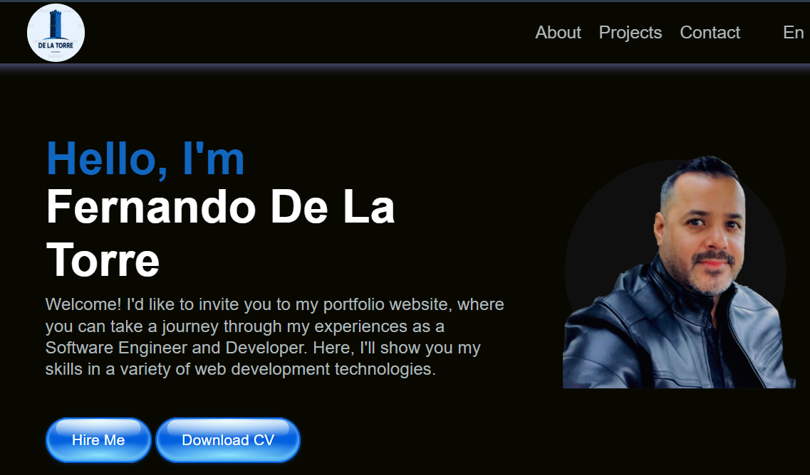

# My 2024 Portfolio

Welcome to my 2024 portfolio! This webpage showcases my skills, projects, and contact information.

## Features

- Responsive design for various devices.
- Navigation menu for easy access to different sections.
- About me section describing my background and skills.
- Projects section displaying my recent work with links to view each project.
- Contact section with a form to send me a message.

## Installation

To view my portfolio locally on your computer, follow these steps:

1. Clone this repository to your local machine using `git clone`.
2. Navigate to the project directory.
3. Open the `index.html` file in your web browser.

## Usage

- Explore the different sections of the webpage using the navigation menu.
- Learn more about me in the "Acerca de mi" section.
- Check out my projects in the "Trabajo Actual" section and click on the links to view each project.
- Contact me using the form in the "Conectemos" section.

## Contact

Feel free to reach out to me via email or connect with me on GitHub and LinkedIn:

- Email: [ferchodlt1971@gmail.com](mailto:ferchodlt1971@gmail.com)
- GitHub: [FernandoDLT](https://github.com/FernandoDLT)
- LinkedIn: [Fernando De La Torre](https://www.linkedin.com/in/fernando-d-3504669b/)

## License

This project is licensed under the [MIT License](LICENSE).
